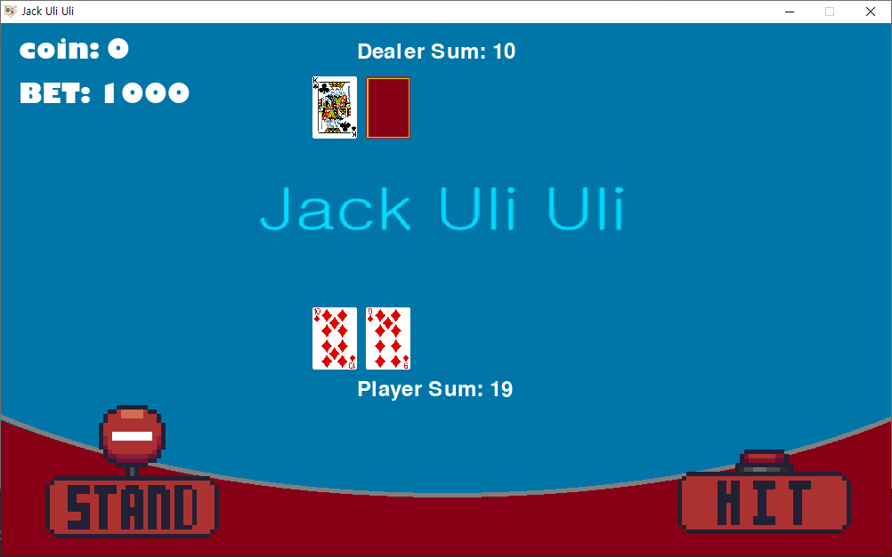

# Blackjack Game in Python

A simple blackjack game implemented in Python using the Pygame library for the graphical interface.

## Features
- **Deck Setup**: Uses a standard 52-card deck with suits (hearts, diamonds, spades, clubs) and ranks (2 to Ace).
- **Betting System**: Players can bet coins before each round.
- **Dealer AI**: Implements a simple dealer AI that hits until reaching a value of 17 or higher.
- **Gameplay Options**: Includes options for hitting, standing, and replaying.

## Requirements
- Python 3.x
- Pygame library (`pip install pygame`)

## How to Play
### Starting the Game:
1. Run `python blackjack_source/blackjack_game.py` to launch the game.
2. Choose game difficulty (Easy or **Hard (Currently Under Development)**) and place your bets.

Alternatively, you can use the executable file `blackjack_game_start.exe` located in `blackjack_start` directory to start the game.

### Gameplay:
- **Hit**: Request another card from the dealer.
- **Stand**: End your turn and let the dealer play.
- **Dealer AI**: Automatically plays according to set rules once the player stands.

### End of Round:
- Results are displayed (Player bust, Dealer bust, Draw, Player wins, Dealer wins).
- Option to replay or return to the main menu.

## File Structure
- `blackjack_source/`: Directory containing the main game file and source code.
  - `blackjack_game.py`: Main game file.
- `blackjack_start/`: Directory containing executable (`blackjack_game_start.exe`) to start the game.
- `images/`: Directory containing game images (cards, buttons, backgrounds).
- `README.md`: Documentation file (this file).

## Contributing
Contributions are welcome! If you have any suggestions, bug fixes, or improvements, please fork the repository and create a pull request.

## Credits
- Developed by SALKOGI07
- Pygame library: [Pygame](https://www.pygame.org/)

## License
This project is licensed under the MIT License.
